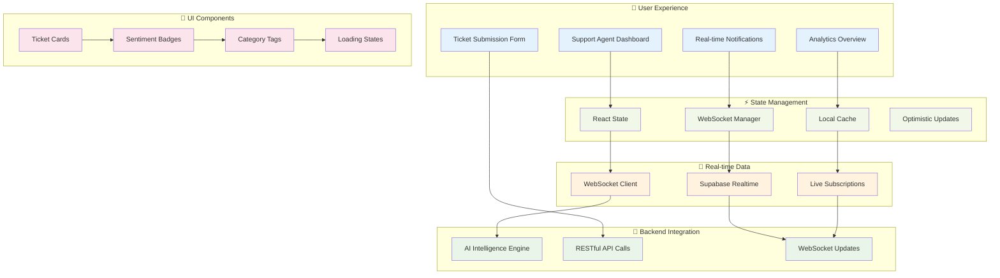
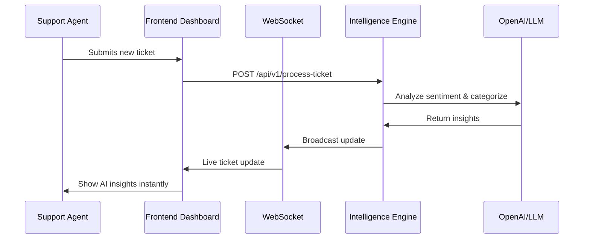

# 🖥️ Experience Layer - Frontend Dashboard

[](https://reactjs.org)
[](https://typescriptlang.org)
[](https://vitejs.dev)
[](https://tailwindcss.com)
[](https://bun.sh)

---

## 🎨 Where Intelligence Meets Beauty

This is the **face** of our AI-Powered Support Co-Pilot—the interface where complex AI decisions become intuitive human experiences. While our backend thinks, this frontend **feels**.

We've crafted something special: a dashboard that doesn't just display data—it **tells stories**, **reveals insights**, and **anticipates needs** with the same elegance found in the best Silicon Valley products.

> *"The best interface is the one you don't notice—until you can't live without it."*

---

## ✨ What Makes This Experience Magical

### **⚡ Real-Time Everything**
- **Zero-latency updates** via optimized WebSocket connections
- **Instant AI insights** appear the moment tickets are processed
- **Live sentiment tracking** with beautiful animated transitions
- **No page refreshes, ever** - everything flows seamlessly

### **🎨 Design That Delights**
- **Pixel-perfect interfaces** built with Tailwind CSS
- **Smooth micro-interactions** that feel natural and responsive
- **Intelligent color coding** for instant sentiment recognition
- **Mobile-first responsive design** that works everywhere

### **🧠 Intelligence Made Visual**
- **AI insights at a glance** with confidence indicators
- **Smart categorization display** with intuitive iconography
- **Sentiment analysis visualization** using color psychology
- **Trend analysis** showing support patterns over time

---

## 🏗️ Architecture & Experience Flow



---

## 🚀 Technology Stack

### **⚡ Performance-First Framework**
- **React 18** with Concurrent Features for smooth UX
- **TypeScript 5+** for bulletproof type safety
- **Vite 5** with lightning-fast HMR and optimized builds
- **Bun** for ultra-fast dependency management and scripts

### **🎨 Design System**
- **Tailwind CSS 3+** for utility-first styling
- **Custom design tokens** for consistent branding
- **Responsive design patterns** that adapt beautifully
- **CSS animations** for delightful micro-interactions

### **🔄 Real-Time Integration**
- **Native WebSocket** client for instant updates
- **Supabase realtime** for database subscriptions
- **Optimistic UI updates** for perceived performance
- **Intelligent reconnection** handling

### **🛡️ Type Safety & Quality**
- **Strict TypeScript** configuration
- **ESLint + Prettier** for code consistency
- **Component-driven development** with clear interfaces
- **Props validation** for runtime safety

---

## 🚀 Quick Start

### **1. Enter the Experience**

```bash
# Navigate to the experience layer
cd frontend

# Install dependencies at light speed with Bun
bun install
```

### **2. Configure Your Environment**

Create your `.env` file for seamless backend integration:

```env
# 🔗 Backend Intelligence Connection
VITE_API_BASE_URL=http://localhost:8000

# 💾 Supabase Real-time Configuration
VITE_SUPABASE_URL=https://your-project.supabase.co
VITE_SUPABASE_ANON_KEY=your-supabase-anon-key

# 🔄 WebSocket Configuration
VITE_WS_URL=ws://localhost:8000/ws

# 🎯 Feature Flags
VITE_ENABLE_ANALYTICS=true
VITE_ENABLE_NOTIFICATIONS=true
VITE_DEBUG_MODE=false
```

### **3. Launch the Experience**

```bash
# Start the high-performance development server
bun run dev

# Open your browser and witness the magic
# http://localhost:5173
```

---

## 🎯 Core Features & Components

### **🎫 Intelligent Ticket Dashboard**

```tsx
// Real-time ticket updates with AI insights
const TicketCard = ({ ticket }: { ticket: Ticket }) => {
  const sentimentColor = {
    Positive: 'bg-green-100 text-green-800',
    Neutral: 'bg-yellow-100 text-yellow-800', 
    Negative: 'bg-red-100 text-red-800'
  };

  return (
    <div className="p-6 bg-white rounded-xl shadow-sm hover:shadow-lg transition-all">
      <div className="flex items-center justify-between mb-4">
        <span className="text-sm font-medium text-gray-500">
          #{ticket.id.slice(0, 8)}
        </span>
        <div className="flex space-x-2">
          <span className={`px-3 py-1 rounded-full text-xs font-medium ${sentimentColor[ticket.sentiment]}`}>
            {ticket.sentiment}
          </span>
          <span className="px-3 py-1 rounded-full text-xs font-medium bg-blue-100 text-blue-800">
            {ticket.category}
          </span>
        </div>
      </div>
      
      <p className="text-gray-800 mb-4">{ticket.description}</p>
      
      <div className="flex items-center justify-between text-sm text-gray-500">
        <span>Confidence: {(ticket.confidence * 100).toFixed(1)}%</span>
        <span>{formatTimeAgo(ticket.created_at)}</span>
      </div>
    </div>
  );
};
```

### **⚡ Real-Time Updates**

```tsx
// WebSocket connection for instant AI insights
const useRealtimeTickets = () => {
  const [tickets, setTickets] = useState<Ticket[]>([]);
  const [connectionStatus, setConnectionStatus] = useState<'connecting' | 'connected' | 'disconnected'>('connecting');

  useEffect(() => {
    const ws = new WebSocket(import.meta.env.VITE_WS_URL);

    ws.onopen = () => {
      setConnectionStatus('connected');
      showNotification('Connected to AI Intelligence Engine', 'success');
    };

    ws.onmessage = (event) => {
      const update = JSON.parse(event.data);
      
      // Optimistic UI update
      setTickets(prev => {
        if (update.type === 'ticket_processed') {
          return [update.ticket, ...prev.filter(t => t.id !== update.ticket.id)];
        }
        return prev;
      });

      // Show beautiful notification
      showNotification(`Ticket ${update.ticket.id} processed as ${update.ticket.category}`, 'info');
    };

    ws.onclose = () => setConnectionStatus('disconnected');

    return () => ws.close();
  }, []);

  return { tickets, connectionStatus };
};
```

### **🎨 Sentiment Visualization**

```tsx
// Beautiful sentiment analysis display
const SentimentIndicator = ({ sentiment, confidence }: { sentiment: string, confidence: number }) => {
  const config = {
    Positive: { color: 'from-green-400 to-green-600', icon: '😊', label: 'Happy Customer' },
    Neutral: { color: 'from-yellow-400 to-yellow-600', icon: '😐', label: 'Neutral Inquiry' },
    Negative: { color: 'from-red-400 to-red-600', icon: '😟', label: 'Needs Attention' }
  };

  const { color, icon, label } = config[sentiment as keyof typeof config];

  return (
    <div className="flex items-center space-x-3 p-4 rounded-lg bg-white shadow-sm">
      <div className={`w-12 h-12 rounded-full bg-gradient-to-br ${color} flex items-center justify-center text-white text-xl`}>
        {icon}
      </div>
      <div>
        <div className="font-semibold text-gray-800">{label}</div>
        <div className="text-sm text-gray-500">
          {(confidence * 100).toFixed(1)}% confidence
        </div>
      </div>
    </div>
  );
};
```

---

## 🎯 User Experience Flows

### **1. 📝 Ticket Submission**
1. Support agent opens the clean, intuitive submission form
2. Types or pastes customer inquiry with smart text validation
3. Clicks submit and watches real-time processing indicator
4. Sees instant AI categorization with confidence scores
5. Reviews sentiment analysis with contextual insights

### **2. 📊 Dashboard Monitoring**
1. Agent opens dashboard to beautiful overview of all tickets
2. Filters by category, sentiment, or time period with smooth animations
3. Watches new tickets appear in real-time via WebSocket updates
4. Clicks any ticket for detailed AI analysis breakdown
5. Exports reports or shares insights with team

### **3. 🔔 Smart Notifications**
1. Browser notifications for high-priority (negative sentiment) tickets
2. In-app toast messages for completed AI processing
3. Visual indicators for new arrivals and status changes
4. Sound alerts (optional) for urgent customer issues

---

## 🛠️ Development Experience

### **Available Scripts**

```bash
# 🚀 Start development server with hot reloading
bun run dev

# 🏗️ Build optimized production bundle
bun run build

# 👀 Preview production build locally  
bun run preview

# 🧹 Lint and format code
bun run lint
bun run format

# 🧪 Run type checking
bun run type-check
```

### **Project Structure**

```
src/
├── 🎨 components/           # Reusable UI components
│   ├── ui/                 # Base design system components
│   ├── icons/              # Custom icon set
│   └── layout/             # Layout components (Header, Sidebar)
├── 📄 pages/               # Main application pages
│   ├── home/               # Dashboard and main views
│   ├── about/              # Company information
│   ├── email/              # Email integration
│   ├── message/            # Messaging components
│   ├── news/               # Updates and announcements
│   ├── review/             # Customer feedback
│   └── services/           # Service offerings
├── 🔧 hooks/               # Custom React hooks
│   ├── use-intersection-observer.tsx
│   └── use-media-query.tsx
├── 📦 types/               # TypeScript type definitions
├── 🎨 styles/              # Global styles and themes
└── 🔧 utils/               # Utility functions
```

### **Component Development Philosophy**

```tsx
// Every component follows our design principles
interface ComponentProps {
  // Props are always typed and documented
  variant?: 'primary' | 'secondary' | 'danger';
  size?: 'sm' | 'md' | 'lg';
  children: React.ReactNode;
  className?: string;
}

// Components are composable and reusable
export const Button = ({ variant = 'primary', size = 'md', children, className = '', ...props }: ComponentProps) => {
  const baseStyles = 'font-medium rounded-lg transition-all duration-200 focus:outline-none focus:ring-2 focus:ring-offset-2';
  const variants = {
    primary: 'bg-blue-600 hover:bg-blue-700 text-white focus:ring-blue-500',
    secondary: 'bg-gray-200 hover:bg-gray-300 text-gray-900 focus:ring-gray-500',
    danger: 'bg-red-600 hover:bg-red-700 text-white focus:ring-red-500'
  };
  const sizes = {
    sm: 'px-3 py-1.5 text-sm',
    md: 'px-4 py-2 text-base',
    lg: 'px-6 py-3 text-lg'
  };

  return (
    <button 
      className={`${baseStyles} ${variants[variant]} ${sizes[size]} ${className}`}
      {...props}
    >
      {children}
    </button>
  );
};
```

---

## 🎨 Design System

### **🎨 Color Palette**

```css
/* AI-themed color system */
:root {
  /* Primary - AI Blue */
  --color-primary-50: #eff6ff;
  --color-primary-500: #3b82f6;
  --color-primary-900: #1e3a8a;

  /* Sentiment Colors */
  --color-positive: #10b981;   /* Green for positive sentiment */
  --color-neutral: #f59e0b;    /* Amber for neutral sentiment */
  --color-negative: #ef4444;   /* Red for negative sentiment */

  /* Semantic Colors */
  --color-success: #059669;
  --color-warning: #d97706;
  --color-error: #dc2626;
  --color-info: #0891b2;
}
```

### **✨ Animation Philosophy**

- **Micro-interactions**: Subtle hover states and focus rings
- **Page transitions**: Smooth navigation with loading states  
- **Real-time updates**: Gentle fade-in animations for new content
- **Performance-first**: Hardware-accelerated CSS transforms

### **📱 Responsive Breakpoints**

```css
/* Mobile-first responsive design */
/* xs: 0px - Default mobile */
/* sm: 640px - Large mobile */
/* md: 768px - Tablet */
/* lg: 1024px - Desktop */
/* xl: 1280px - Large desktop */
/* 2xl: 1536px - Extra large */
```

---

## 🔗 Backend Integration

### **🤖 AI Intelligence Engine Connection**

```typescript
// Seamless integration with our Python FastAPI backend
class AIService {
  private baseURL = import.meta.env.VITE_API_BASE_URL;

  async processTicket(ticketData: CreateTicketRequest): Promise<ProcessedTicket> {
    const response = await fetch(`${this.baseURL}/api/v1/process-ticket`, {
      method: 'POST',
      headers: { 'Content-Type': 'application/json' },
      body: JSON.stringify(ticketData)
    });

    if (!response.ok) throw new Error('AI processing failed');
    
    return response.json();
  }

  async getTickets(): Promise<Ticket[]> {
    const response = await fetch(`${this.baseURL}/api/v1/tickets`);
    return response.json();
  }
}
```

### **⚡ Real-time Data Synchronization**

```typescript
// Live updates via WebSocket and Supabase
const useRealtimeSync = () => {
  const supabase = createClient(
    import.meta.env.VITE_SUPABASE_URL,
    import.meta.env.VITE_SUPABASE_ANON_KEY
  );

  useEffect(() => {
    const channel = supabase
      .channel('tickets')
      .on('postgres_changes', 
        { event: '*', schema: 'public', table: 'tickets' },
        (payload) => {
          // Handle real-time database changes
          handleTicketUpdate(payload);
        }
      )
      .subscribe();

    return () => supabase.removeChannel(channel);
  }, []);
};
```

---

## 🚀 Production Build

### **Optimized Bundle**

```bash
# Build for production with maximum optimization
bun run build

# Bundle analysis
bun run build --analyze

# Output: dist/
#   ├── assets/
#   │   ├── index-[hash].js     # Main application bundle
#   │   ├── vendor-[hash].js    # Third-party dependencies  
#   │   └── index-[hash].css    # Compiled styles
#   └── index.html              # Entry point
```

### **Performance Metrics**

- **⚡ First Contentful Paint**: < 1.5s
- **🎯 Largest Contentful Paint**: < 2.5s
- **📊 Cumulative Layout Shift**: < 0.1
- **🔄 First Input Delay**: < 100ms
- **📦 Bundle Size**: < 250kb gzipped

### **Deployment Ready**

```bash
# Deploy to Vercel (recommended)
bun run build && vercel --prod

# Deploy to Netlify
bun run build && netlify deploy --prod --dir=dist

# Docker deployment
FROM node:18-alpine
WORKDIR /app
COPY package.json bun.lockb ./
RUN bun install --frozen-lockfile
COPY . .
RUN bun run build
EXPOSE 3000
CMD ["bun", "run", "preview", "--host"]
```

---

## 🎯 User Stories & Experience Goals

### **Support Agent Experience**
> *"I want to see ticket sentiment immediately so I can prioritize urgent customer issues."*

**Our Solution**: Color-coded sentiment indicators with confidence scores appear instantly as tickets are processed.

### **Manager Experience**  
> *"I need real-time visibility into support patterns to make data-driven decisions."*

**Our Solution**: Live dashboard with sentiment trends, category distribution, and processing metrics.

### **Customer Experience (Indirect)**
> *"I want my issues understood and resolved quickly."*

**Our Solution**: AI categorization ensures tickets reach the right specialist immediately, while sentiment analysis flags urgent cases.

---

## 🌟 What Makes This Frontend Special

### **1. 🧠 Intelligence-First Design**
- Every UI element reflects AI insights naturally
- Confidence scores provide transparency in AI decisions
- Smart defaults based on learned patterns

### **2. ⚡ Performance Obsession**
- Bun for lightning-fast development and builds
- Optimistic UI updates for perceived instant responses
- Lazy loading and code splitting for optimal loading

### **3. 🎨 Design That Scales**
- Component-driven architecture for consistency
- Tailwind utility classes for rapid iteration
- Responsive design that works on any device

### **4. 🔄 Real-Time Everything**
- WebSocket connections for instant updates
- Supabase realtime for database synchronization
- Optimistic UI for seamless user experience

---

## 🎯 Integration with Intelligence Engine

This frontend is the perfect companion to our [AI Intelligence Engine](../python-api):



---

## 🔮 Roadmap & Vision

### **Q1 2026 - Enhanced Intelligence**
- [ ] **Voice input** for ticket creation
- [ ] **Smart suggestions** based on ticket patterns
- [ ] **Predictive text** for common responses
- [ ] **Advanced analytics** with trend prediction

### **Q2 2026 - Mobile & Collaboration**
- [ ] **Native mobile apps** (iOS, Android)
- [ ] **Team collaboration** features
- [ ] **Real-time chat** integration
- [ ] **Multi-language** interface support

---

## 🤝 Contributing to the Experience

We believe great UX comes from great collaboration:

1. **Design Feedback**: Share your experience and suggest improvements
2. **Feature Requests**: Help us understand user needs
3. **Bug Reports**: Help us maintain the quality experience
4. **Code Contributions**: Follow our component design patterns

---

**Crafted with 🎨 design excellence and ⚡ performance obsession by the Experience Team.**

*This isn't just a frontend—this is where human intuition meets artificial intelligence.*